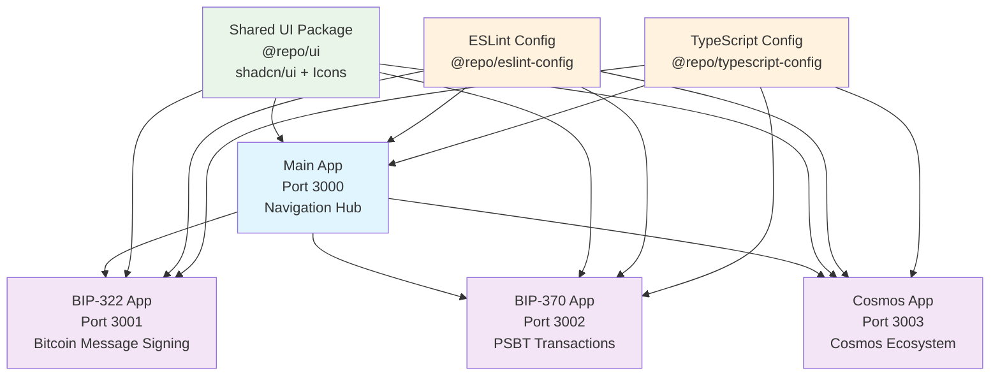

# Blockchain Test DApp Monorepo

A Turborepo monorepo containing multiple blockchain testing applications built with React, TypeScript, and Vite.

## What's inside?

This Turborepo includes the following packages/apps:

### Apps and Packages

- `main`: Navigation app that provides links to all test DApps (Port 3000)
- `bip322`: Standalone BIP-322 message signing test application (Port 3001)
- `bip370`: Standalone BIP-370 PSBT test application (Port 3002)
- `cosmos`: Standalone Cosmos blockchain test application (Port 3003)
- `ton`: Standalone TON wallet and TonConnect bridge test application (Port 3004)
- `imtoken`: Standalone imToken wallet integration test application (Port 3005)
- `tip712`: Standalone TRON TIP-712 signing test application (Port 3006)
- `tron`: Standalone TRON transaction preview test application (Port 3007)
- `@repo/ui`: Shared React component library with shadcn/ui components
- `@repo/eslint-config`: Shared ESLint configurations
- `@repo/typescript-config`: Shared TypeScript configurations

Each package/app is 100% [TypeScript](https://www.typescriptlang.org/).

## Development

### Install Dependencies

```bash
pnpm install
```

### Start Individual Apps

```bash
# Start navigation app (main) on port 3000
pnpm dev:main

# Start BIP-322 app on port 3001
pnpm dev:bip322

# Start BIP-370 app on port 3002
pnpm dev:bip370

# Start Cosmos app on port 3003
pnpm dev:cosmos

# Start TON app on port 3004
pnpm dev:ton

# Start imToken app on port 3005
pnpm dev:imtoken

# Start TIP-712 app on port 3006
pnpm dev:tip712

# Start TRON preview app on port 3007
pnpm dev:tron

# Start all apps in parallel
pnpm dev:all
```

### Development URLs

When running in development mode, the apps are available at:

- **Main (Navigation)**: http://localhost:3000
- **BIP-322**: http://localhost:3001
- **BIP-370**: http://localhost:3002
- **Cosmos**: http://localhost:3003
- **TON**: http://localhost:3004
- **imToken**: http://localhost:3005
- **TIP-712**: http://localhost:3006
- **TRON Preview**: http://localhost:3007

### Build

To build all apps and packages:

```bash
pnpm build
```

### Lint

To lint all apps and packages:

```bash
pnpm lint
```

### Format

To format all code:

```bash
pnpm format
```

## Project Structure

```
apps/
├── main/           # Navigation app (Port 3000)
├── bip322/         # BIP-322 test app (Port 3001)
├── bip370/         # BIP-370 test app (Port 3002)
├── cosmos/         # Cosmos test app (Port 3003)
├── ton/            # TON test app (Port 3004)
├── imtoken/        # imToken test app (Port 3005)
├── tip712/         # TIP-712 test app (Port 3006)
└── tron/           # TRON transaction preview app (Port 3007)

packages/
├── ui/             # Shared UI components (shadcn/ui)
├── eslint-config/  # Shared ESLint config
└── typescript-config/ # Shared TypeScript config
```

## Features

### Main App (Navigation)

- Central hub with links to all test applications
- Environment-aware URL generation (dev/prod)
- Modern, responsive UI with dark mode support

### BIP-322 App

- Bitcoin message signing and verification
- BIP-322 standard implementation
- Bitcoin address validation
- Wallet provider integration (MetaMask, OKX, OneKey, imToken)

### BIP-370 App

- PSBT (Partially Signed Bitcoin Transaction) creation
- Bitcoin transaction building and signing
- BIP-370 standard implementation
- Advanced transaction analysis tools

### Cosmos App

- Cosmos wallet integration (Keplr, Leap)
- Transaction signing and broadcasting
- Chain registry integration
- Interchain UI components
- Multi-chain support

### TRON Preview App

- TRON wallet connection through injected TronWeb providers
- One-transaction unknown contract signing preview with USDT approval intent in calldata
- Standard USDT approve control transaction for preview comparison
- Sign-only workflow with no broadcasting

### Cross-App Theme Synchronization

- **Seamless Theme Experience**: Theme changes sync across all applications
- **Real-time Updates**: Theme switches in one app instantly reflect in others
- **Persistent Storage**: Theme preferences persist across sessions
- **URL Parameter Support**: Theme state passed between apps via URL parameters
- **System Theme Detection**: Automatic light/dark mode based on system preferences

For detailed information about the theme synchronization feature, see [THEME_SYNC.md](./THEME_SYNC.md).

## Tech Stack

- **Framework**: React 18 + TypeScript
- **Build Tool**: Vite
- **Styling**: Tailwind CSS + shadcn/ui
- **Monorepo**: Turborepo
- **Package Manager**: pnpm
- **Blockchain Libraries**:
  - bitcoinjs-lib (Bitcoin apps)
  - @cosmjs/\* (Cosmos app)
  - @cosmos-kit/\* (Cosmos wallet integration)

## Architecture

This project follows a modular monorepo architecture where:

1. **Independent Apps**: Each functionality is separated into its own application for better maintainability and deployment flexibility.

2. **Shared Components**: Common UI components are shared through the `@repo/ui` package.

3. **Environment Awareness**: Apps automatically detect their environment and adjust URLs accordingly.

4. **Type Safety**: Strict TypeScript configuration ensures type safety across all applications.

### Project Architecture Diagram



## Deployment

This project is designed to be deployed as multiple independent applications on Vercel. See [DEPLOYMENT.md](./DEPLOYMENT.md) for detailed deployment guide.

### Quick Deployment

Each application can be independently deployed to Vercel:

1. **Main App (Navigation)**: `blockchain-test-dapp-main.vercel.app`
2. **BIP-322 App**: `blockchain-test-dapp-bip322.vercel.app`
3. **BIP-370 App**: `blockchain-test-dapp-bip370.vercel.app`
4. **Cosmos App**: `blockchain-test-dapp-cosmos.vercel.app`

### Environment Configuration

In production environment, the navigation app automatically detects the environment and generates correct links. Configure in Vercel project settings:

```
VITE_BASE_URL=https://blockchain-test-dapp
```

## Development Tips

### Adding New UI Components

To add new shadcn/ui components:

```bash
pnpm ui:add <component-name>
```

### Package Dependencies

Each app manages its own dependencies while sharing common packages through the workspace configuration. This approach:

- Ensures each app only includes necessary dependencies
- Maintains clear dependency boundaries
- Allows for independent versioning

### Icon Usage

All Lucide React icons are exported from `@repo/ui` package. Import them like:

```tsx
import { Button, Moon, Sun, Cable } from '@ui/components'
```

## Remote Caching

Turborepo can use [Remote Caching](https://turbo.build/repo/docs/core-concepts/remote-caching) to share cache artifacts across machines. To enable:

```bash
npx turbo login
npx turbo link
```

## Useful Links

- [Deployment Guide](./DEPLOYMENT.md)
- [Turborepo Documentation](https://turbo.build/repo/docs)
- [BIP-322 Specification](https://github.com/bitcoin/bips/blob/master/bip-0322.mediawiki)
- [BIP-370 Specification](https://github.com/bitcoin/bips/blob/master/bip-0370.mediawiki)
- [Cosmos SDK Documentation](https://docs.cosmos.network/)
- [shadcn/ui Documentation](https://ui.shadcn.com/)
- [Vercel Documentation](https://vercel.com/docs)

## Contributing

1. Fork the repository
2. Create a feature branch
3. Make your changes
4. Test all applications
5. Submit a pull request

## License

MIT License - see LICENSE file for details.
